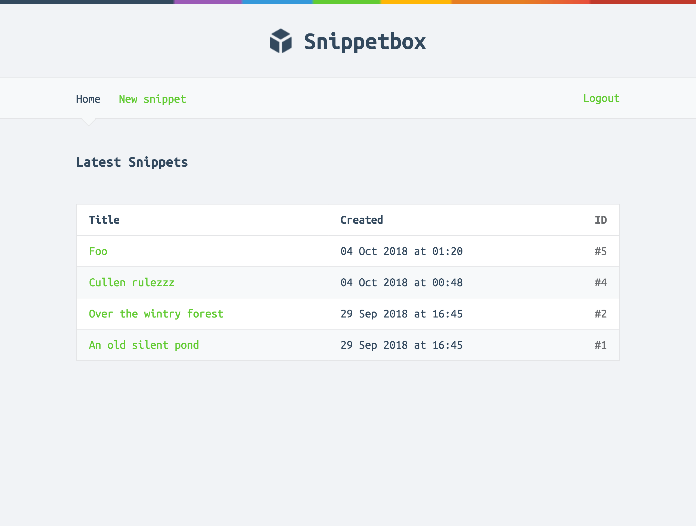

# SnippetBox

A simple Go web application for storing and sharing code snippets.



## Features
- User-friendly web UI for creating, viewing, and listing code snippets
- Snippet expiration (1 day, 1 week, 1 year)
- Secure session management
- Form validation with helpful error messages
- Clean, responsive design

## Getting Started

### Prerequisites
- Go 1.20+
- MySQL server

### Setup
1. **Clone the repository:**
   ```powershell
   git clone <your-repo-url>
   cd snippetbox
   ```
2. **Set up the database:**
   - Create a MySQL database and user.
   - Import the schema (see `internal/models/snippets.go` for table structure).
3. **Configure environment:**
   - Edit the DSN in `cmd/web/main.go` or use the `-dsn` flag:
     ```
     web:pass@/snippetbox?parseTime=true
     ```
4. **Run the application:**
   ```powershell
   go run ./cmd/web
   ```
   The server will start on `http://localhost:8080` by default.

### Usage
- Visit `http://localhost:8080` to see the home page.
- Click "Create Snippet" to add a new snippet.
- View, share, and browse snippets.


## Project Structure
```
go.mod
cmd/web/         # Main web app (handlers, routes, templates)
internal/models/ # Data models (snippets, users)

internal/validator/ # Form validation helpers
ui/html/         # HTML templates
ui/static/       # CSS, images, JS
```

## License
MIT
